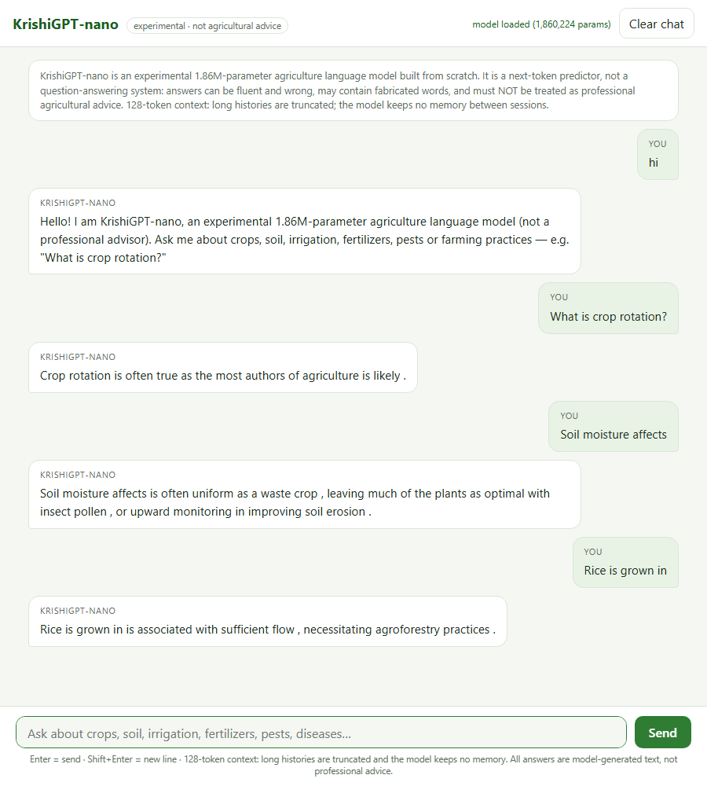

# KrishiGPT-nano — a 1.86M-parameter agriculture language model built from scratch

**Final submission package.** Everything internal to this project — BPE
tokenizer, transformer architecture, training loop, sampling, evaluation — is
implemented from scratch (no HuggingFace Transformers, no tiktoken). The final
frozen checkpoint is `checkpoints/krishigpt_v3/best.pt`, hash-pinned by
`final/FREEZE_MANIFEST.json` and set read-only.

> All generated text is **MODEL OUTPUT**: next-token prediction, not
> human-authored, not verified agricultural advice.



| fact | value |
|---|---|
| Final checkpoint | `checkpoints/krishigpt_v3/best.pt` (training step 3800) |
| SHA-256 | `137cc83da53dd873cbab22c82e7344c7c84882d79b37017a37c765ff38e14536` |
| Parameters | 1,860,224 |
| Validation loss / perplexity | **4.0804 / 59.17** (byte-fixed 172-window set) |
| Fabricated words (top-p 0.9) | 4.5% (attested against own training text) |
| Tokenizer | from-scratch BPE, vocab 5,237 |
| Context window | 128 tokens |
| Compute | CPU-trained (Intel i5-1335U); later runs on Colab Tesla T4 |
| Tests | 177 passing (`python -m pytest tests`) |

---

## 1. Project overview

KrishiGPT-nano is a Small Language Model (SLM) for the agriculture domain,
pretrained on a curated, license-clean agriculture corpus (Wikipedia CC BY-SA
4.0 + Project Gutenberg US public domain; ICAR/FAO/USDA deliberately excluded
because reuse rights are not machine-verifiable). It generates
agriculture-themed continuations from short prompts. It is **not** a
question-answering or instruction-following system: no retrieval, no fact
checking, no tool use.

The project demonstrates a complete, tested, reproducible from-scratch SLM
pipeline: corpus governance with per-document provenance → BPE tokenizer →
decoder-only transformer → AdamW training with warm-start lineage → fixed
evaluation protocol with a word-level fabrication metric → 3-level capability
funnel → QA fine-tuning with an honest diagnose → fix → re-measure loop.

**Highlights**

- **From scratch, all the way down**: tokenizer, RoPE attention, training loop,
  sampling, evaluation — no HF/tiktoken/sentencepiece, 177 tests.
- **Warm-start lineage across 5 pretraining runs** (v1 → v3), every validation
  number on a byte-fixed never-trained set — all comparable, no eval drift.
- **A 3-level evaluation funnel** (training health / instruction following /
  domain MCQ) that caught a real overfitting failure before it could be
  mistaken for progress.
- **Post-freeze instruction tuning**: constraint-format QA data moved
  instruction-bench compliance from 0% → 20% at 1.86M parameters — with the
  benchmark's exact phrasing deliberately held out of training.
- **Frozen source of truth**: the submitted checkpoint is SHA-256 pinned and
  was re-verified byte-identical after every post-freeze experiment.

## 2. Architecture

6-block decoder-only transformer, GPT-2-style pre-norm (see
`final/DIAGRAMS.md` for ASCII + Mermaid diagrams):

| component | detail |
|---|---|
| Blocks | 6 |
| d_model | 128 |
| Attention | 4 heads (d_k = 32), causal mask, RoPE on Q and K |
| Normalization | LayerNorm, pre-norm |
| Feed-forward | Linear 128→256, exact GELU, Linear 256→128 |
| Embedding/head | 5,237 vocab, token embedding **tied** with the LM head |
| Dropout | 0.0 |
| Max context | 128 |

Parameter accounting: 6 blocks × 198,272 = 1,189,632 + tied embedding/head
670,336 + final LayerNorm 256 = **1,860,224**. The tying is structural —
`lm_head.weight.data_ptr() == tok_emb.weight.data_ptr()` is asserted in tests
and in the checkpoint verifier.

Code: `model/` (`embeddings`, `rope`, `attention`, `multi_head`, `feed_forward`,
`normalization`, `transformer_block`, `positional`, `gpt`, `generate`).

## 3. Dataset sources

Three versioned corpora under `data/`, every document carrying per-document
provenance (`*.meta.json`: provider, URL, license, access date) recorded
**before** use:

| corpus | documents | BPE train tokens | focus added |
|---|---|---|---|
| v1 | 37 (32 Wikipedia + 5 Gutenberg PD) | 897,225 | first corpus, cleaned + deduped |
| v2 | 89 (82 wiki + 7 Gutenberg PD) | 1,150,725 | machines/plant pathology/India/pests |
| v3 (final) | 184 (97 new wiki + 4 new Gutenberg PD) | 1,966,105 | diseases, pests, nutrient chemistry, soil science, Indian state agriculture, irrigation, farming practices |

Hygiene: Wikipedia citation sections cut, Gutenberg banners stripped, exact
long-line dedupe, deterministic document-level split (seed 0).

**Validation set (byte-fixed since v2, never trained in any run):** 6
documents (Combine harvester, No-till farming, Loam, Phosphorus cycle,
Rainwater harvesting, Rabi crop) = 22,026 BPE tokens, byte-identical across
v2/v2-ext/v3, so all validation losses since v2 are directly comparable.

License notes: Wikipedia CC BY-SA 4.0 attribution is recorded per article and
kept with the corpus; Gutenberg books are US public domain. See
`final/MODEL_CARD.md` §9.

## 4. Tokenizer

From-scratch **BPE** (`tokenizer/`), one tokenizer for the entire run lineage:

- 4 special tokens (PAD/UNK/BOS/EOS) + 159 base characters + 5,000 learned
  merges = **vocab 5,237**.
- Trained **once** on the v1 train split; saved to
  `data/processed/agri_bpe_tokenizer.json`; never modified since, keeping
  checkpoint compatibility and the embedding table learned through the lineage.
- Measured on final corpus text: 280.2 tokens/1000 chars, word-level UNK
  0.10%, avg 1.398 tokens/word — inside the established reuse threshold.

## 5. Training pipeline

AdamW (betas 0.9/0.95), weight decay 0.1 on 2D params only, grad clip 1.0,
cosine LR 6e-4 → 6e-5 with 200-step warmup, seq_len 128, batch 16, seed 0,
CPU-only. Warm starts transfer weights **and** optimizer state. Final-run
config: `configs/nano_agri_v3.json`. Checkpointing every 300 steps, validation
every 100, `best.pt` kept on best validation loss.

Warm-start lineage (validation losses comparable from v2 onward):

| run | start | corpus | steps (new) | val loss | val ppl | checkpoint |
|---|---|---|---|---|---|---|
| v1 full | scratch | v1 | 800 | 5.7076* | 301.1 | krishigpt_nano_full |
| v1 extended | v1 full | v1 | +1,752 | 5.2720* | 194.8 | krishigpt_nano_extended |
| v2 warm-start | v1 ext | v2 | 2,336 | 4.5068 | 90.63 | krishigpt_nano_v2 |
| v2 extended | v2 | v2 | +2,336 | 4.3761 | 79.52 | krishigpt_nano_v2_extended |
| **v3 (FINAL, frozen)** | v2 ext | v3 | 3,840 | **4.0804** | **59.17** | **krishigpt_v3/best.pt** |
| *v4 (post-freeze research)* | *v3 (frozen)* | *v4 how-to corpus* | *4,440 (T4 GPU)* | *3.9752* | *53.3* | *krishigpt_v4/best.pt* |

\* v1 runs used the v1-era validation documents — not comparable with the
byte-fixed numbers. Cumulative gradient exposure through the lineage ≈ 17.3M
tokens.

### Post-freeze QA fine-tuning (v4 lineage, Colab GPU)

After the v3 freeze, the same architecture was fine-tuned for Q/A formats in
two rounds (full story: `evaluation/corpus_v4/EXPERIMENT_v4_qa.md`):

| round | data | schedule | instruction compliance | domain MCQ |
|---|---|---|---|---|
| baseline (v3) | — | — | 0% | 24.8% (≈ chance) |
| 1: `krishigpt_v4_qa` | 616 definitional pairs | 63 steps | 0% | 20.8% |
| 2: `krishigpt_v4_qa2` | 801 pairs incl. constraint formats (yes/no 251/118, one-word, list-of-three) | 63 steps | **20%** | 21.8% |

Round 1 taught only the Q/A surface format — the funnel caught it (compliance
stayed 0%), and the diagnosis (constraint formats never demonstrated in the
data; noisy extracted pairs) drove the round-2 fix. The 0% → 20% gain came
from *data format*, not scale: both list-of-three tests now pass, and the model
starts answers in the right shape ("Does rice need water? → yes") though it
cannot reliably stop — a 128-token context limitation. The submitted v3
checkpoint stayed byte-identical (SHA-verified before and after every run).

## 6. Final metrics (frozen checkpoint)

Measured by `final/final_eval.py`; machine-readable copy in
`final/final_eval.json`:

| metric | value |
|---|---|
| val loss / ppl (byte-fixed, 172 windows) | **4.0804 / 59.17** |
| greedy rep-rate / distinct-1 | 0.879 / 0.134 (degenerate — do not use) |
| top-k 40 rep-rate / distinct-1 / distinct-2 | 0.308 / 0.697 / 0.943 |
| **top-p 0.9 rep-rate / distinct-1 / distinct-2** | **0.190 / 0.812 / 0.994** |
| fabricated words, top-p 0.9 / top-k 40 | 4.5% / 4.0% |
| decode throughput | ~21–46 tok/s on CPU |
| recommended decoding | top-p 0.9, seed 0 |

15 labeled generation samples: `final/showcase_samples.md`.

## 7. Inference / generation

Setup (any OS, CPU-only):

```powershell
python -m venv .venv
.\.venv\Scripts\Activate.ps1          # Windows (bash: source .venv/bin/activate)
pip install -r requirements.txt
```

**One-command demo** (frozen final checkpoint is the default; seeded,
reproducible top-p sampling):

```powershell
python inference/demo.py
python inference/demo.py --prompts "Rice is grown in" --max-tokens 64
```

Equivalent low-level CLI:

```powershell
python model/generate.py --checkpoint checkpoints/krishigpt_v3/best.pt `
    --tokenizer data/processed/agri_bpe_tokenizer.json `
    --decode sample --top-p 0.9 --seed 0 --max-tokens 64 `
    --prompts "The best fertilizer for wheat"
```

Every printed continuation is labeled `MODEL OUTPUT` — treat it as
illustrative only.

## 8. Chatbot (API + Web UI)

A simple ChatGPT-style chat interface over the **frozen final checkpoint** —
no retraining, no model/tokenizer changes. Built with FastAPI + plain
HTML/CSS/JS (no frontend framework).

**Architecture:** `api/app.py` loads `checkpoints/krishigpt_v3/best.pt` ONCE
at server startup (process-wide cached `KrishiGenerator` from
`model/generate.py` — generation logic is reused, not duplicated) and serves:

| endpoint | what it does |
|---|---|
| `GET /` | web chat UI (`api/static/`) |
| `GET /health` | model status, checkpoint SHA-256, params, decoding defaults |
| `POST /chat` | `{"message": "..."}` or `{"messages": [{role, content}, ...]}` → `{"response": "...", "disclaimer": ...}` |
| `GET /docs` | auto-generated OpenAPI docs |

**Decoding defaults** (from the final evaluation, `final/final_eval.json`):
top-p 0.9, temperature 1.0, optional fixed seed. Greedy decoding is never
used — the evaluation showed it degenerates into loops (rep-rate 0.879).

**Conversation history:** the model has a 128-token context and no memory.
Turns are flattened into one bounded `Q:/A:` prompt; oldest turns are dropped
first to fit the window (the response reports `dropped_turns`). Do not treat
this as long-term memory.

**Start the server** (repo root):

```powershell
python -m uvicorn api.app:app --host 127.0.0.1 --port 8000
```

Then open <http://127.0.0.1:8000> in a browser. UI: message input, Enter =
send, Shift+Enter = newline, user/assistant bubbles, loading indicator, clear
chat, graceful error display; responsive for desktop and mobile. The
screenshot above (`assets/chatbot_demo.png`) is a real session against the
frozen checkpoint.

**API examples** (bash):

```bash
curl http://127.0.0.1:8000/health

curl -X POST http://127.0.0.1:8000/chat \
  -H "Content-Type: application/json" \
  -d '{"message": "What is crop rotation?", "seed": 0, "max_tokens": 64}'

curl -X POST http://127.0.0.1:8000/chat \
  -H "Content-Type: application/json" \
  -d '{"messages": [
        {"role": "user", "content": "What is soil erosion?"},
        {"role": "assistant", "content": "Soil erosion is the removal of topsoil."},
        {"role": "user", "content": "How can farmers prevent it?"}],
       "seed": 0}'
```

**Honest quality note.** The chatbot wraps a 1.86M-parameter next-token
predictor; it is not instruction-tuned and has no knowledge beyond its
training corpus. Real example (seed 0): asking *"How can farmers prevent it?"*
after a soil-erosion exchange returns fluent agriculture-adjacent but
grammatically broken text ("wilting erosion, cover crops or clay compost,
ambition...") containing fabricated words. Every response carries the
disclaimer that outputs must not be treated as professional agricultural
advice. The UI displays the same disclaimer permanently.

## 9. Reproducibility

Everything runs locally from this package:

```powershell
python -m pytest tests                          # 190 tests (incl. 13 chatbot API tests)
python final/verify_final_checkpoint.py         # hash + load + generate (run
                                                # from OUTSIDE the project root)
python final/final_eval.py                      # regenerate final_eval.json numbers
python final/showcase_samples.py                # regenerate showcase samples
```

Reproducibility chain: corpus text + provenance on disk (`data/`), tokenizer
on disk (`data/processed/agri_bpe_tokenizer.json`), run configs in `configs/`,
training log in `checkpoints/krishigpt_v3/train_log.jsonl`, checkpoint frozen
by SHA-256 manifest with read-only attribute (`final/FREEZE_MANIFEST.json`).
Seeded sampling reproduces `final/final_eval.json` bit-for-bit.

## 10. Limitations

1. **No factuality.** 1.86M parameters cannot support fact claims; fluent and
   wrong can appear in the same sentence. Outputs must never be read as
   agricultural guidance.
2. **Fabrication floor ~4%.** Sampled text contains novel wordforms assembled
   from frequent BPE pieces; this is a capacity + data-scale floor, not fully
   solvable at this scale.
3. **Greedy decoding is degenerate** (loops, Wikipedia section artifacts) —
   use sampling.
4. **128-token context**; samples truncate mid-thought. No KV cache,
   quantization, or batching.
5. **Small validation set** (6 documents, 22,026 tokens).
6. **Domain-narrow**: quality degrades fast outside the training distribution.

7. **Chatbot answers are not reliable.** The web chat flattens history into
   one prompt and generates a continuation; answers can be fluent and wrong,
   and the Q/A format is a UI convention the model was never trained on.
   Full analysis: `final/FINAL_REPORT.md`, `final/MODEL_CARD.md`.

## 11. Project structure

```
├── README.md                     this file
├── requirements.txt              pinned dependencies (CPU-only)
├── conftest.py                   pytest path setup
├── assets/chatbot_demo.png       chatbot screenshot (real frozen-checkpoint output)
├── model/                        from-scratch transformer + generation CLI
├── tokenizer/                    from-scratch char/word/BPE tokenizers
├── training/                     AdamW train loop, QA fine-tune, checkpointing, loss
├── inference/demo.py             one-command generation from the final checkpoint
├── api/                          chatbot: FastAPI app + static web UI
│   ├── app.py                    /health, /chat, static serving (load-once)
│   └── static/                   index.html, style.css, app.js (no framework)
├── configs/                      run configs (nano_agri_v3.json = final run;
│                                 nano_agri_v4*.json = post-freeze QA lineage)
├── data/
│   ├── processed/                frozen BPE tokenizer + tokenized v1 corpus
│   ├── corpus_v2/, corpus_v3/, corpus_v4/   corpora + provenance + caches
│   ├── qa/, qa_v2/               auto-generated QA pairs (post-freeze rounds)
│   ├── raw/, sources/            v1 raw downloads + source records
│   └── build_agriculture_corpus.py, dataset.py, preprocessing.py
├── checkpoints/krishigpt_v3/     FINAL: best.pt (frozen) + train_log.jsonl
├── evaluation/                   eval harness + funnel benches + experiment
│                                 records (corpus_v2/v3/v4) + results
├── colab/                        generated Colab notebooks (v4 QA lineage, GPU)
├── final/                        submission artifacts (report, model card,
│                                 diagrams, eval JSON, showcase, freeze manifest,
│                                 verification scripts)
└── tests/                        tests (incl. test_api.py chatbot tests)
```

Deliberately **not** in the submission package: intermediate step checkpoints,
lineage/dry-run/smoke checkpoints, dry-run configs, pre-flight debug scripts,
corpus hash scratch files, and empty placeholder directories (kept in the
working repo only).
