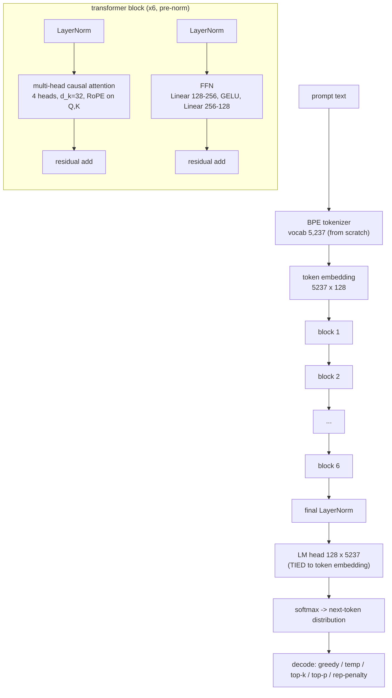
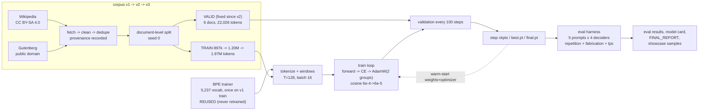

# KrishiGPT-nano — Diagrams

Two diagrams: the model architecture and the training pipeline. ASCII versions
(render anywhere) plus Mermaid sources (render in any Markdown viewer that
supports Mermaid: GitHub, VS Code preview, mermaid.live, document converters).

---

## 1. Model architecture (KrishiGPT-nano, final = checkpoints/krishigpt_v3/best.pt)

### ASCII

```
                    prompt ("The best fertilizer for wheat")
                                        |
                          [ BPE tokenizer, vocab 5,237 ]        (from scratch,
                                        |                        no HF/tiktoken)
                          token ids (T <= 128)
                                        |
                    +-------------------v--------------------+
                    |  Token Embedding  (5237 x 128)         |<--+
                    |  dropout 0.0                           |   | TIED weights
                    +-------------------+--------------------+   | (same storage)
                                        |                        |
                +------------  x 6 transformer blocks  ---------+----------+
                |                                                              |
                |   x --------------------------------------------------+     |
                |   |  LayerNorm                                        |     |
                |   |     |                                             |     |
                |   |  Multi-Head Causal Self-Attention                 |     |
                |   |   4 heads, d_k = 32                               |     |
                |   |   RoPE rotations applied to Q and K               |     |
                |   |   causal mask (future tokens invisible)           |     |
                |   |     |                                             |     |
                |   +---(residual add) <-------------------------------+|     |
                |   |                                                   |     |
                |   |  LayerNorm                                        |     |
                |   |     |                                             |     |
                |   |  Feed-Forward: Linear 128->256, GELU, Linear 256->128    |
                |   |     |                                             |     |
                |   +---(residual add) <------------------------- x ----+     |
                |                                                               |
                +---------------------------------------------------------------+
                                        |
                              final LayerNorm
                                        |
                              LM head (128 x 5237)  <---- tied to embedding
                                        |
                                   softmax over vocabulary
                                        |
                              next-token logits -> decode
                     (greedy | temperature | top-k | top-p | rep. penalty)
```

Parameter accounting: 6 blocks × 198,272 = 1,189,632 + tied embedding/head 670,336
+ final LN 256 = **1,860,224 params** (the head is free via weight tying).

### Mermaid



---

## 2. Training pipeline (data -> tokens -> training -> evaluation)

### ASCII

```
 SOURCES (license-verifiable only; per-doc provenance JSON)
   Wikipedia (CC BY-SA 4.0, attribution recorded)      Project Gutenberg (public domain)
        |                                                       |
        +----------------------+--------------------------------+
                               v
                    FETCH, CLEAN, DEDUPE
   - citation sections cut, banners stripped, junk lines dropped
   - exact long-line dedupe across documents
                               |
                               v
               DOCUMENT-LEVEL SPLIT (seed 0, deterministic)
   - v1-validation docs reserved out permanently
   - v2-validation docs (6) never enter ANY train set; the validation
     split has been BYTE-IDENTICAL since v2 (22,026 tokens)
                               |
        +----------------------+------------------------+
        v                                               v
  TRAIN: v1 897k -> v2 1.20M -> v3 1.97M tokens      VALID: 22,026 tokens (same set
  (tokenizer trained ONCE on v1-train;               for v2/v2-ext/v3 -> all val
   reused for v2+v3 -- no retraining)                losses comparable)
        |                                               |
        v                                               v
  window builder: sequence len 128, batch 16, shifted targets (input[:-1] / input[1:])
        |
        v
  TRAINING LOOP (5-line skeleton, repeated by 12M+ batches across the lineage)
   zero_grad -> forward -> CE loss on shifted targets -> backward -> AdamW step
   AdamW: 2 param groups (2D weights wd=0.1, biases/LN wd=0), betas (0.9, 0.95),
   grad clip 1.0, cosine LR 6e-4 -> 6e-5 with 200-step warmup
        |
        |  every 100 steps                    every 300 steps
        v                                     v
   evaluate on the byte-fixed valid set     save step_NNNNNNN.pt
   update best.pt when val loss improves    final.pt on exit; train_log.jsonl
        |
        v
  CHECKPOINT LINEAGE (weights + optimizer warm-started forward; steps/tokens
  logged per checkpoint):

   v1 full (800 st, 1.64M tok)          val 5.7076 / ppl 301.1   [v1 valid docs]
     -> v1 extended (2552 total, 4.92M) val 5.2720 / ppl 194.8
     -> v2 warm-start (2336 new, 4.71M) val 4.5068 / ppl 90.63   [v2 valid = v3 valid]
     -> v2 extended (4636 total, 9.42M) val 4.3761 / ppl 79.52
     -> v3 warm-start (3840 new, 7.78M) val 4.0804 / ppl 59.17   <-- FINAL (frozen)

        |
        v
  EVALUATION HARNESS (identical protocol at every checkpoint)
   - val loss / perplexity on the fixed 172 windows
   - generation: 5 prompts x {greedy, temp0.9, top-k40, top-p0.9}, fixed seeds
   - repetition/distinctness + word-level fabrication (attested vs own corpus)
   - throughput (tokens/sec)
        |
        v
   final/final_eval.json, final/showcase_samples.md, final/FINAL_REPORT.md
```

### Mermaid



Notes:
- RoPE is the only positional mechanism (no learned positional embeddings).
- Weight tying is structural: `lm_head.weight.data_ptr() == tok_emb.weight.data_ptr()`
  is asserted in tests, pre-flight scripts, and the clean-environment verifier.
- The validation set is byte-identical from v2 onward — that is what makes the
  val-loss column comparable across runs.
